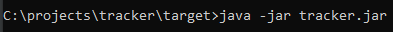
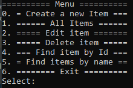

# Tracker
## Первый проект обучающего курса [job4j.ru](https://job4j.ru/).

##### Пройдено в курсе и использовано в проекте:

- ***Основы Java*** (синтаксис Java, ООП).
- ***Паттерны*** - стратегия, декоратор.
- ***Checkstyle*** - инструмент статического анализа кода.
- ***JUnit*** - библиотека для модульного тестирования.
- ***Maven*** - фреймворк для автоматизации сборки проектов.
- ***Git*** - распределённая система управления версиями.
- ***JaCoCo*** - библиотека для анализа покрытия кода.
- ***Travis CI*** - сервис для сборки и тестирования ПО.

## О проекте.
Проект преставляет собой хранилище для заявок. 

**В приложении имеются возможности:**
- добавить заявку.
- редактировать заявку.
- удалить заявку.
- получить список всех заявок.
- получение заявок по имени. 
- получение заявки по уникальному id.

---

## Запуск приложения.

Запуск приложения осуществляется в консоли.

---

## Использование.

Работа с приложением осуществляется в консоли путем ввода пунктов меню и требуемых данных.

##### Пункты меню приложения:

- **Create a new Item** - добавлении новой заявки в хранилище.
- **All Items** - получение списка всех заявок из хранилища.
- **Edit Item** - отредактировать заявку по id .
- **Delete Item** - удаление заявки по id.
- **Find Item By Id** - поиск заявки в хранилище по id.
- **Find Item By Name** - поиск заявки в хранилище по названию.
- **Exit** - выход из приложения.

---

## Контакты.

***email:*** moroz.future@gmail.com

